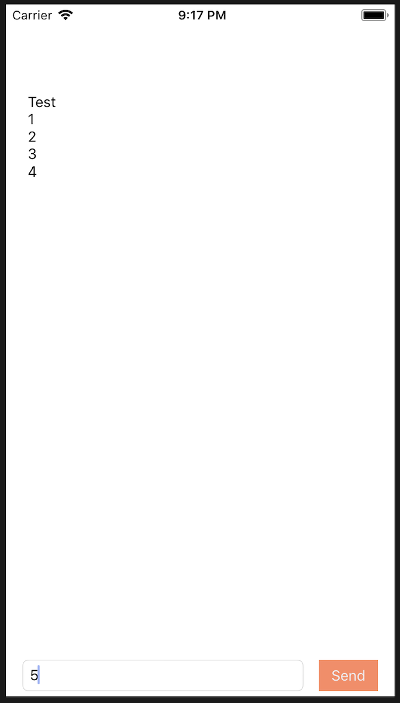

# Chat App Client for iOS

A chat app for iOS devices that sends texting data to a remote server. The message data is encrypted using the OpenSSL library.

  

Staff
-----

Programmer: Joon Kang

Mentor: Samil Chai

Work Period
-----------

Start Date: 2017-09-07

End Date: 2017-10-13

Privacy
-------

*Portions of source code have been removed for privacy purposes.*

